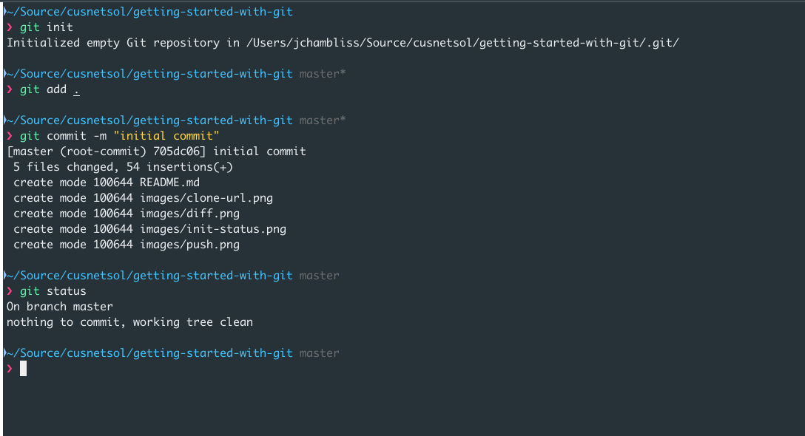
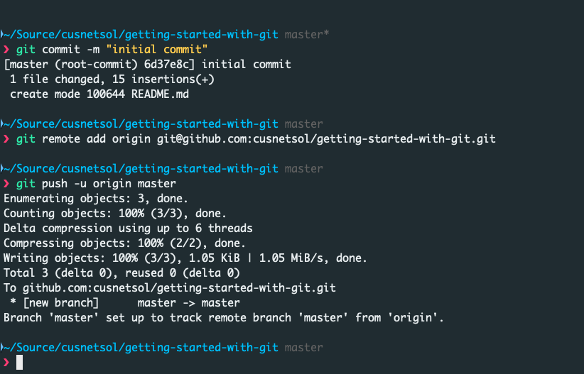
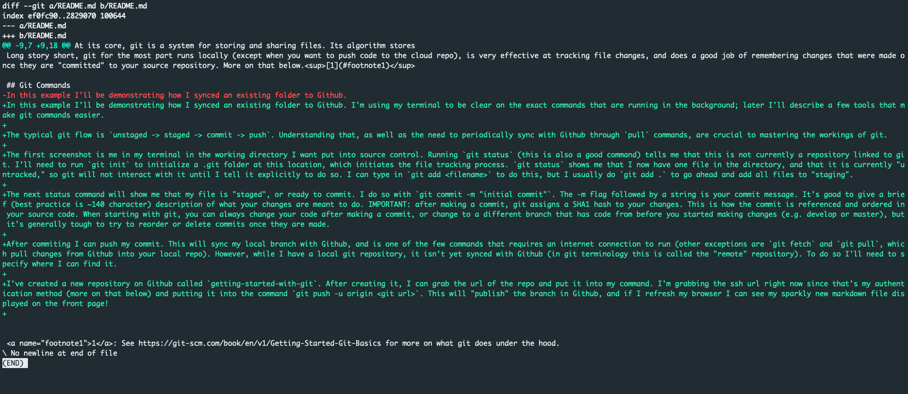

# Getting Started with Git
Edit to demo git

Congratulations! You have made the wise decision to utilize git as your source code control option. Use of git ensures that code is available, secure, and clear with respect changes that have occurred to the codebase over time. Git also allows you to 'branch' from the master version to test new features while maintaining a clear distinction between test and production versions of your code.

Properly managed, git is robust and powerful, allowing teams to rapidly develop and collaborate on their products. However, it can have a steep learning curve. This document seeks to serve as a brief reference guide for those just getting started with git to understand how it is used to improve the developer's workflow.

## Table of Contents
[1. Git: What is it?](#what)  
[2. Git Commands](#commands)  
[3. Git Branching](#branching)  
[4. Git with Multiple Developers](#multidevs)  
[5. Helpful Tools](#tools)  
[6. Footnotes](#footnotes)

## <a name="what" id="what">Git: What is it?</a>
At its core, git is a system for storing and sharing files. Its algorithm stores a repository in "snapshots" that link to the most recently changed version of each file. Git files are stored locally, and use the SHA1 algorithm to track and record these changes.

Long story short, git for the most part runs locally (except when you want to push code to the cloud repo), is very effective at tracking file changes, and does a good job of remembering changes that were made once they are "committed" to your source repository. More on that below.[1](#footnote1)

## <a name="commands" id="commands">Git Commands</a>
In this example I'll be demonstrating how I synced an existing folder to Github. I'm using my terminal to be clear on the exact commands that are running in the background; later I'll describe a few tools that make git commands easier.

The typical git flow is `unstaged -> staged -> commit -> push`. Understanding that, as well as the need to periodically sync with Github through `pull` commands, are crucial to mastering the workings of git. The first screenshot is me in my terminal in the working directory I want put into source control. Running `git status` (this is also a good command) tells me that this is not currently a repository linked to git. I'll need to run `git init` to initialize a .git folder at this location, which initiates the file tracking process. `git status` shows me that I now have one file in the directory, and that it is currently "untracked," so git will not interact with it until I tell it explicitly to do so. I can type in `git add <filename>` to do this, but I usually do `git add .` to go ahead and add all files to "staging".

The next status command will show me that my file is "staged", or ready to commit. I do so with `git commit -m "initial commit"`. The -m flag followed by a string is your commit message. It's good to give a brief (best practice is ~140 character) description of what your changes are meant to do. IMPORTANT: after making a commit, git assigns a SHA1 hash to your changes. This is how the commit is referenced and ordered in your source code. When starting with git, you can always change your code after making a commit, or change to a different branch that has code from before you started making changes (e.g. develop or master), but it's generally tough to try to reorder or delete commits once they are made.

After commiting I can push my commit. This will sync my local branch with Github, and is one of the few commands that requires an internet connection to run (other exceptions are `git fetch` and `git pull`, which pull changes from Github into your local repo). However, while I have a local git repository, it isn't yet synced with Github (in git terminology this is called the "remote" repository). To do so I'll need to specify where I can find it.

I've created a new repository on Github called `getting-started-with-git`. After creating it, I can grab the url of the repo and put it into my command. I'm grabbing the ssh url right now since that's my authentication method (more on that below) and putting it into the command `git push -u origin <git url>`. This will "publish" the branch in Github, and if I refresh my browser I can see my sparkly new markdown file displayed on the front page!

If I make changes to the file, git tracks them and tells me what's changed. I can run `git status` again to see which files have changed, and can also run `git diff`, optionally specifying a particular file to see what exactly has been changed. From there I can go through the same `stage -> commit -> push` flow demonstrated earlier.

## <a name="branching" id="branching">Git Branching</a>
One of the most useful features of git is the ability to create "branches" from the source code. If my production code is in the "master" branch, for example, I can create a new branch called "develop" by doing `git checkout -b develop` (the -b flag specifies that the branch is a new one). At that point, no matter what I commit or push to the develop branch, the codebase in master will remain unchanged. A good development workflow will use several branches: for modern development processes that have implemented a robust CI/CD pipeline, there is one branch for production code (e.g. master), one for staging (staging or release), and one for testing (development or test). Developers can work on new features from the testing branch, and can adopt a branch naming pattern that corresponds to what the feature is or in some other way associates the branch with what's being worked on (if you're using a workflow management tool such as Jira, for instance, your feature branches can be named after the Jira key). When my changes have been fully tested and I know they are ready for production, then I can "merge" branches. To do so, I can `git checkout master` (-b isn't needed since this branch already exists) then run `git merge develop` to merge the changes I've committed into develop onto the master branch. I can then run `git push` to push all those changes up to master.

## <a name="multidevs" id="multidevs">Git with Multiple Developers</a>
Git becomes more powerful with the addition of other developers. As contributors push commits, each of which contains a short description of the changes they've made in addition to a full catalogue of the changes in the code based on the git files, you have a full, evolving record of how your code has changed over time, and who made those changes. However, there is a good and bad way to use git on a team. I will show you the worst way, and after I will show you the best way.

Imagine Peter wants to make changes to a file. Rather than go through the rigamarole of checking out a feature branch, commiting, publishing, and then merging his changes, Peter just writes then pushes them to master. That's where they'll all end up anyway, right? Wrong. I'm here right now to tell you this is bad. Bad, bad, very bad Peter. Let's observe why:
1. Pushing to master obviates any kind of CI/CD process; if we only use one branch for everything, then it becomes very difficult to test different features in different environments. Many tools in AWS hook very easily into Github, for instance, but they'll want to know a particular branch to listen on for changes. Having just one branch means we can only have one environment, which means we can't simulate a production environment before pushing changes to our customers.
2. If multiple people are pushing to the same branch simultaneously, then it becomes difficult to time exactly _when_ to sync code with each other. If you're working in the same files, git is also prone to encounter "conflicts", where it can't determine which version of the code is preferred. Merging conflicts can be tricky without the right tools and some practice.[2](#footnote2)
3. Using the single branch strategy can also lead to the misconception that what you have locally is the master version of the code. This is false if you have more than one collaborator, or even if you're working from more than one computer. You need to constantly be making commits, pushing, and pulling from your remote repository to ensure you have the most recent codebase.

With the above in mind, let's take Casey, a well-schooled coder who branches her code from a develop branch, pushes, then creates pull requests in Github to see whether her code causes conflicts, and to make sure she's merging into the latest version of the code at a given branch. Well done, Casey! Doing pull requests in this manner also allows you to specify reviewers for a commit, adding a peer-review element to check code quality at the moment it's merged rather than waiting months to discover a bug that someone else wrote.[3](#footnote3) Will Casey's code be as buggy as Peter's? Probably. But this way we're more likely to catch them earlier.

## <a name="tools" id="tools">Helpful Tools</a>
The best way to learn git is to practice (and occasionally mess up) with it! Luckily there are several great tools to assist you. While using the command line as in my examples gives you a good idea of what's going on at a given moment, it also has the steepest learning curve, and may add in unnecessary steps if you don't already use it frequently. Other options include:
- [Visual Studio's Github Extension](https://visualstudio.github.com/) - This is a good tool you can download as a Visual Studio extension. It connects to the "Team Explorer" tab to hook into your Github account. In addition to cloning, pulling, and pushing your code, you can also make and view pull requests.
- [Visual Studio Code](https://code.visualstudio.com/) - Another product developed by Microsoft, VSCode is an increasingly feature-rich text editor that includes the best git extension I've personally used right out of the box. It can also be configured to run/debug .NET applications, but it's up to you to decide whether to learn another tool than the one you already know.
- [Github Desktop](https://desktop.github.com/) - This is an excellent application that I just discovered. It takes all of the commands mentioned above plus more and puts them into a readable, fast, and effective UI client. Honestly, if I didn't already use the command line and VSCode so much, I might start using this. It also has a tutorial project to help you learn the basics out of the box.

## <a name="footnotes" id="footnotes">Footnotes</a>
<a name="footnote1" id="footnote1">1</a>: See https://git-scm.com/book/en/v1/Getting-Started-Git-Basics and https://www.atlassian.com/git/tutorials/what-is-git for more on what git does under the hood.
<a name="footnote2">2</a>: See https://help.github.com/en/articles/about-merge-conflicts on conflicts and some strategies to resolve them when they do occur.
<a name="footnote3">3</a>: Pull requests are essential in a mature git strategy, and Github adds in some great options to an already great feature. cf. https://help.github.com/en/articles/about-pull-requests
